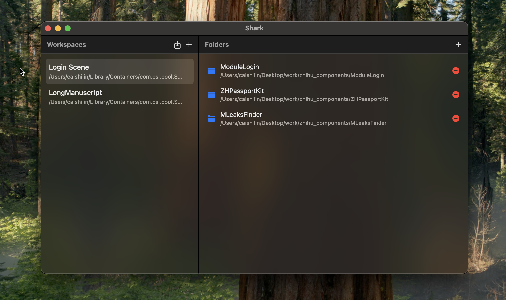

# Shark 🦈

A beautiful macOS application for managing Cursor IDE workspace files. Streamline your development workflow by organizing and managing multiple Cursor workspaces with ease.

## ✨ Features

### Workspace Management
- **Create New Workspaces** - Quickly create new `.code-workspace` files with a single click
- **Import Existing Workspaces** - Import and manage your existing Cursor workspace files
- **Multiple Workspace Support** - Manage all your workspaces in one place
- **Rename Workspaces** - Easily rename your workspaces to keep them organized

### Folder Management
- **Add Folders** - Add multiple folders to your workspace files with drag-and-drop simplicity
- **Visual Folder List** - See all folders in your workspace at a glance
- **Automatic Saving** - Changes are automatically saved to your workspace files

### Quick Actions
- **Double-Click to Open** - Open workspaces in Cursor with a simple double-click
- **Context Menu** - Right-click for quick actions:
  - Open workspace in Cursor
  - Show workspace file in Finder
  - Rename workspace
  - Remove workspace
- **Native macOS Integration** - Built with SwiftUI for a native macOS experience

## 🚀 Why Use Shark?

### For Developers Who Use Cursor IDE
If you work with multiple projects or need to organize your development environment, Shark makes it effortless to:
- Switch between different project workspaces
- Organize related folders into workspaces
- Quickly access your most-used workspaces
- Keep your workspace files organized and up-to-date

### Clean & Intuitive Interface
Shark features a clean, modern interface that follows macOS design guidelines:
- Split-view layout for easy navigation
- Workspace list on the left
- Folder list on the right
- Native macOS controls and behaviors

### Privacy & Security
- All workspace data is stored locally on your Mac
- File system access requires explicit user authorization
- No data collection or cloud sync

## 📦 Installation

### Download
Download the latest release from the [Releases](https://github.com/SSBun/Shark/releases) page.

### Install
1. Download `Shark-1.0.0.dmg` (or latest version)
2. Open the DMG file
3. Drag Shark to your Applications folder
4. Launch Shark from Applications

### System Requirements
- macOS 14.0 or later
- Cursor IDE (for opening workspaces)

## 🎯 Getting Started

1. **Launch Shark** - Open the application from your Applications folder
2. **Grant Permissions** - When prompted, grant file system access permissions
3. **Create or Import a Workspace**:
   - Click the **+** button to create a new workspace
   - Click the **↓** button to import an existing workspace file
4. **Add Folders** - Select a workspace and click "Add Folder" to add project folders
5. **Open in Cursor** - Double-click a workspace or use the context menu to open it in Cursor

## 💡 Tips

- **Double-click** any workspace to quickly open it in Cursor
- **Right-click** workspaces for additional options
- Workspaces are automatically saved when you make changes
- Imported workspaces remain at their original location
- New workspaces are created in Shark's settings folder

## 🔧 Technical Details

- Built with **SwiftUI** and **Swift 6**
- Native macOS application
- Supports Cursor IDE `.code-workspace` file format
- Stores workspace metadata in UserDefaults
- Requires file system access for reading/writing workspace files

## 📄 License

This project is open source. See the repository for license details.

## 🤝 Contributing

Contributions are welcome! Please feel free to submit a Pull Request.

## 📮 Support

For issues, feature requests, or questions, please open an issue on GitHub.

---

**Made with ❤️ for the Cursor IDE community**

