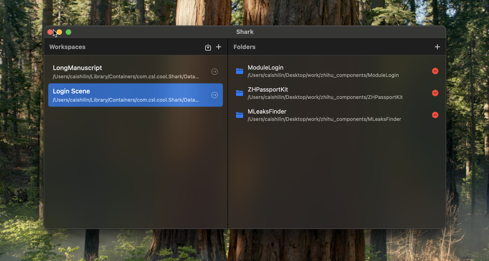

# Shark 🦈

A macOS workspace manager for Cursor, Trae, and Claude Code. Organize projects into workspaces, manage Venomfiles dependencies, and quickly open everything in your preferred IDE.



**Official Website**: https://ssbun.github.io/Shark

## ✨ Features

### Workspace Management
- **Cursor / Trae Workspaces** - Create, import, and manage `.code-workspace` files
- **Claude Code Workspaces** - Create workspace directories with symlinked component folders, ready for Claude Code CLI
- **Multiple Workspace Support** - Manage all your workspaces in one place
- **Rename Workspaces** - Easily rename your workspaces to keep them organized

### Folder Management
- **Add Folders** - Add multiple folders via drag-and-drop, file dialog, or component selector
- **Component Selector** - Browse and pick components from configurable search paths
- **Copy Path** - Right-click to copy folder path(s) to clipboard
- **Visual Folder List** - See all folders in your workspace at a glance with git branch badges
- **Automatic Saving** - Changes are automatically saved to your workspace files

### Quick Actions
- **Double-Click to Open** - Open workspaces in Cursor, Trae, or terminal (for Claude Code) with a double-click
- **Context Menu** - Right-click for quick actions:
  - Open workspace in Cursor, Trae, or terminal
  - Show workspace file in Finder
  - Rename workspace
  - Remove workspace

### Settings
- **IDE Selector** - Switch between Cursor, Trae, or terminal for opening workspaces
- **Components Search Paths** - Configure multiple directories to search for components
- **Venomfiles Support** - Check dependencies for components with Venomfiles folders
- **Refresh Dependencies** - Refresh Venomfiles status for all components

### Venomfiles Management
- **Check Dependencies** - Scan and verify dependencies for Venomfiles projects
- **Jump to Repository** - Open dependency repositories directly in your browser
- **Edit Source** - Open `.rb` source files in your system default editor
- **Visual Status** - See dependency status at a glance with refresh capability

## 🚀 Why Use Shark?

### For Developers Who Use Cursor, Trae, or Claude Code
If you work with multiple projects or need to organize your development environment, Shark makes it effortless to:
- Switch between different project workspaces
- Organize related folders into workspaces
- Quickly access your most-used workspaces
- Keep your workspace files organized and up-to-date
- Manage Venomfiles dependencies across your components

### Clean & Intuitive Interface
Shark features a clean, modern interface that follows macOS design guidelines:
- Split-view layout for easy navigation
- Workspace list on the left
- Folder list on the right
- Native macOS controls and behaviors

### Privacy & Security
- All workspace data is stored locally on your Mac
- File system access requires explicit user authorization
- No data collection or cloud sync

## 📦 Installation

### Quick Install (One Command)
Run this command in your terminal to download the latest version:

```bash
curl -sL https://github.com/SSBun/Shark/raw/main/install_latest.sh | bash
```

The script will:
1. Download the latest Shark DMG to your Downloads folder
2. Open the DMG file automatically

Then:
1. Drag Shark.app to your Applications folder
2. If macOS shows "Shark is damaged" error, run:
   ```bash
   xattr -rd com.apple.quarantine /Applications/Shark.app
   ```

Or clone the repository and run the script locally:

```bash
git clone https://github.com/SSBun/Shark.git
cd Shark
./install_latest.sh
```

### Manual Install
1. Download the latest `Shark-x.x.x.dmg` from the [Releases](https://github.com/SSBun/Shark/releases) page
2. Open the DMG file
3. Drag Shark to your Applications folder
4. **Important**: If macOS shows "Shark is damaged" error, run:
   ```bash
   xattr -rd com.apple.quarantine /Applications/Shark.app
   ```

### System Requirements
- macOS 14.0 or later
- Cursor IDE, Trae IDE, or Claude Code CLI (for opening workspaces)

## 🎯 Getting Started

1. **Launch Shark** - Open the application from your Applications folder
2. **Grant Permissions** - When prompted, grant file system access permissions
3. **Create or Import a Workspace**:
   - Click the **+** button to create a new workspace
   - Click the **↓** button to import an existing workspace file
4. **Add Folders** - Select a workspace and click "Add Folder", "Select Components", or drag folders directly into the folder area
5. **Open in IDE** - Double-click a workspace or use the context menu to open it in your configured IDE

## 💡 Tips

- **Double-click** any workspace to quickly open it in your IDE
- **Drag & Drop** folders directly into the folder list to add them to your workspace
- **Right-click** workspaces for additional options
- Workspaces are automatically saved when you make changes
- Imported workspaces remain at their original location
- New workspaces are created in Shark's settings folder

## 🔧 Technical Details

- Built with **SwiftUI** and **Swift 6**
- Native macOS application
- Supports Cursor/Trae `.code-workspace` files and Claude Code workspace directories
- Claude Code workspaces use symlinks for component folders
- Stores workspace metadata in UserDefaults
- Requires file system access for reading/writing workspace files

## 📄 License

This project is open source. See the repository for license details.

## 🤝 Contributing

Contributions are welcome! Please feel free to submit a Pull Request.

## 📮 Support

For issues, feature requests, or questions, please open an issue on GitHub.

---

**Made with ❤️ for the Cursor, Trae, and Claude Code community**

